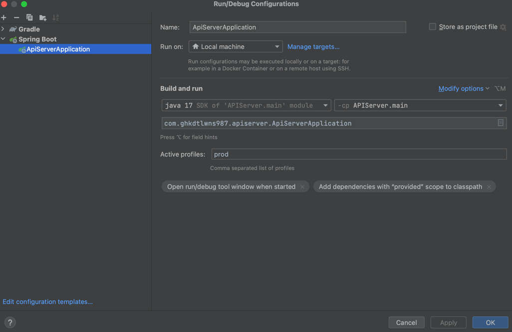

# API_Server
신년을 맞아 열심히 공부하고자 제작하는 프로젝트입니다.  

# Goals
> 해당 프로젝트를 통해 얻고자 하는 내용은 다음과 같습니다.

1. TDD 연습
2. OOP
3. `stream()` 연습
4. 기능 구현

# 기능 구현 리스트
- 회원 CRUD
- 관리자 기능
- 이전에 작성한 인증서버와 연동
- OAuth2 기능 연동
- 외부 서버와의 API 통신
- 추가 예정..

# 진행사항
- 현재까지는 TDD 기반으로 회원 생성 기능을 구현했습니다.  
  나아가 회원 검증 로직과 Dto에서의 `Validation` 을 수행하도록 할 계획이며 현재까지 진행한 코드를 한차례 리팩토링 할 계획입니다.  

(2023/01/02 - 업데이트 내용)
- 현재 Exception 처리를 보다 상세히 출력하기 위해 위해 기존의 `ErrorException` 클래스를 `ClientException`클래스로 변환하기 위한 작업 중입니다.
- `ErrorResponse` 또한 변경중에 있으며 초기 작성은 완료했습니다.
- `QueryDsl` 라이브러리를 추가하여 멤버 Query를 작성했으며 회원을 검색하는 테스틑 코드를 추가했습니다.
- 기존 `CommandMemberServiceImpl` 클래스에서 이미 중복된 회원을 검색하는 로직을 추가했습니다.
- 기존 `JpaRepository` 를 사용하다 세분화하기 위해 `Repository`에서 Create, Delete 기능을 수행하도록 했으며, `CommandMemberRepository` 에서 `Read` 기능을 수행하도록 하였으며 `Custom`하게 제작된 `JpaMemberRepository`룰 `CommandMemberRepository`가 상속받게 함으로써 개발자가 정의한 기능만 사용할 수 있도록 했습니다.

(2023/01/03 - 업데이트 내용)
- queryDsl 테스트 코드를 작성할 때 `QueryDslQueryRepository` 빈을 등록하지 못하는 문제 발생 -> 문제 해결중이며 현재는 대체제로 `@SpringBootTest` 로 모든 `Bean`을 등록해 사용하고 있음.
- https://jyami.tistory.com/124 글을 참고해 `EntitiyManger`와 `jpaQueryFactory`를 `Bean`으로 등록했는데도 인식 못함 -> 문제를 찾아보아야 할 것으로 보임

(2023/01/04 - 업데이트 내용)
- QueryDsl 테스트 코드 작성 
  - 추가 쿼리문 작성
  - 발생한 문제 : `commandmemberservice.save(member)` 테스트마다 하나씩 넣어 회원을 조회하는 코드를 작성했는데 영속성때문인지 `findById` 에서 테스트가 실패함.
  - 개선할 점 : `save()`를 일일히 진행하지 않더라도 `@BeforeEach`에서 `entitiyManager.persist(member)` 글을 봤는데 왜인지 나는 안되서 개선해야 할 것으로 보임

(2023/01/05 - 업데이트 내용)
- BCryptPasswordEncoder 테스트및 비즈니스 로직 수정
- Nickname 수정 부분 코드 작성 및 테스트
- nickname 수정, password 수정 코드 작성
- 기존의 테스트 코드 수정
  - 영속성을 부여하지 않은 채 테스트 코드를 작성했는데 이를 수정함.

(2023/01/06 - 업데이트 내용)
- `MemberCreateRequestDto`에 `Validation` 추가

(2023/01/07 - 업데이트 내용)
- `CommandMemberController` -> 회원가입 기능 작성
- `Exception`처리를 위한 `MemberControllerAdvice` 메서드 작성
- 예외 상태에 따른 클래스를 작성하고 `BusinessException` 를 상속하여 특정 상황에 대한 예외를 출력하도록 함.
- `CommandMemberControllerTest` 테스트 코드 작성
- `Exception` 처리에 따른 테스트 코드 수정
- `Controller` 에서 회원가입 관련 `Validation` 테스트 수행
- `Spring Security` 라이브러리 추가 및 `BCryptpasswordEncoder` `Bean`등록

(2023/01/08 - 업데이트 내용)
- `CommandMemberController` -> 회원 Nickname, Password 수정 기능 작성
- `MemberNicknameUpdateRequestDto` 클래스 수정 -> 테스트를 위해 변수에 값을 주입하는 기본 생성자 추가
- `CommandMemberControllerTest` -> 회원 Nickname, Password 수정 테스트코드 작성

(2023/01/09 - 업데이트 내용)
- `CommandMemberController` -> 회원탈퇴 기능 추가
- `CommandMemberService` -> 회원탈퇴 기능 추가
- `CommandMemberControllerTest` -> 회원탈퇴 기능 테스트코드 작성
- `CommandMemberServiceTest` -> 회원탈퇴 기능 테스트코드 작성
+ 내일 `CommandMemberControllerTest` 추가 수정 예정(현재는 멤버등록 성공만 수정함)
- 발생했던 문제 : Spring Boot 버전이 3.x 로 업데이트 되면서 기존에 사용하던 코드가 작동이 되지 않았다.  
  그 이유는 Spring Security에서 제공하는 CSRF 요청이 강제화 되면서 테스트 코드에서 CSRF 토큰을 함께 전달해야 하는데, 나는 REST 통신만 할거기 때문에 disable 한 상태여도 무방하다.   
  테스트 코드를 작성할 때 `@AutoConfigureMockMvc(addFilters = false)` 를 넣어 주도록 한다.

(2023/01/10 - 업데이트 내용)
- `CommandMemberController` -> 회원 조회 기능 추가
- `CommandMemberService` -> 회원 조회 기능 추가
- `CommandMemberControllerTest` -> 회원 삭제 기능, 회원 조회 기능 테스트코드 작성
- `CommandMemberServiceTest` -> 회원 삭제 기능, 회원 조회 기능 테스트코드 작성
- 그 외 추가 직업

(2023/01/11 - 업데이트 내용)
- Git Repository 재생성
- `CommandMemberController` -> 회원 탈퇴 진행 후 password, nickname가 수행되는 현상 수정
- `ComamndMemberControllerTest` -> 테스트 코드추가 작성

(2023/01/12)
- Roles에서 `ROLE_USER` 로 출력되게끔 수정
- Test코드 수정

(2023/01/13) 
- 로그인 기능 추가(API <-> Auth)(예정)
- 우선 회원 쿠폰 기능 구현(예정)


(2023/01/14)
- 로그인 기능 추가 완료(API <-> Auth 서버간 통신)
  - 로그인 성공 시 `JWT Token` 을 발급함.
  - MemberEntity의 Roles를 `@ElementCollection(fetch = FetchType.LAZY)` 형태로 수정(1:N)(멤버(1)와 권한(N))
  - 현재 권한은 `ROLE_USER`, `ROLE_ADMIN`이 있음.
- Entity 수정으로 인한 테스트코드 수정

(2024/01/15)
- API <-> Auth 서버간 통신할 때 테스트코드는 어떻게 작성해야 하는가?
  - 인증 정보를 가져온다? -> 로그인은 인증 서버에서 수행 후 토큰을 발급하는 방식으로 동작 ==> API 서버에서는 인증 토큰을 발급받지 않음.
  - Auth 서버에서 테스트중... -> 처음엔 단순히 `MockMvc` 로 인증 헤더를 가져오는 방식으로 수행하려고 했는데 `Controller` 에서 요청을 받는게 아닌, `Spring Security` 기반의 필터로 적용되기 때문에 `MockMvc`가 동작하지 않음.
  - 어떻게 모킹해야 하는지 고민중
  - `MockServer` vs `MockMvc` 차이점 공부하기
# 진행해야 할 내용
- 테스트 코드 추가 작성
- 기능 추가(update, withdraw)
- Controller단의 테스트 명세 상세화 + RESTdocs 작성
- 회원 탈퇴 테스트 코드 작성
- Repository 단 부터 테스트 코드에 대한 수정이 필요할 것으로 보임.

(2024/01/17)
- order, catalogs 프로젝트 생성 및 간단한 코드 작성
- 추후 해당 프로젝트의 테스트코드 작성 예정
- 우선 간단하게 작성하고 추후 기능 추가와 동시에 TDD 수행할 예정
- 위 프로젝트로 Kafka와 같은 분산 서비스 통신에 대해 공부해볼 예정

(2024/01/18)
- Order 도메인 추가
- Order 서비스와 통신 수행
- getMemberInfo() 함수에서 order 프로젝트와 통신 확인

(2024/01/21)
- OrderCommand 수정
  - 직렬화 문제가 발생(ResultResponse, ResultListResponse -> ResponseOrderDto로의 직렬화/역질렬화 문제) -> ObjectMapper()로 데이터를 매핑함
- Order 서비스의 Respository Test

(2024/01/22)
- Order 프로젝트
  - 테스트 코드 작성
    - QueryOrderRepository
    - CommandOrderRepository
    - QueryOrderService
    - CommandOrderService

(2024/02/12)
- API 서버
  - 서비스간 통신 및 개수 변경 사항 수정 적용
  - 재고 없을 시 Order 서비스에서 `OUT OF STOCK` 메시지 반환, 하지만 서버에서 `INTERNAL SERVER ERROR` 발생 -> 수정해야 함.
- Order 서버
  - 서비스 수정사항 적용
  - 비즈니스 요구사항에 따른 수정 배포

+ 추가해야 할 점
  - 예외처리(O)
  - Order 프로젝트 Entity 수정
  - Catalog 프로젝트와 연동(O)
  - Order 프로젝트 Controller 테스트코드 작성(O)
  - Catalog 프로젝트 Controller, Service 테스트코드 작성(O)
  - 프로젝트간 통신 과정에서 에러 발생 시 에러 메시지가 data에 포함되는 현상 수정(O)
  - 서비스간 통신시 Order 서비스에서 Catalog 서비스의 정보를 불러오는 로직 추가 (O)
    - Order 서비스에서 Catalog 서비스에 ProductId 가 존재하는지 유무 확인(O)
    - Order 서비스에서 주문 개수 만큼 Catalog 서비스의 qty 줄이는 로직 추가
  - 기능 추가

### 의문점
Q1. `@DataJpaTest와 직접 Mock객체를 주입받는 방식 vs MockitoAnnotations.openMocks(this) 로 객체를 생성하는 방식?;`
A1. `@EntitiyManager`, `@JpaQueryFactory` 를 생성하고 주입받는 `TestConfig.java` 작성, 하지만 그래도 `Bean`이 등록되지 않아 우선 `@SpringBootTest`로 테스트 진행한다.
+ Q3 내용으로 대체

Q2. `JPA 테스트할 때 영속성 문제를 어떻게 해결하는가?`  
A2.  

Q3. `@SpringBootTest`를 한번만 띄우는 방법은?
A3. `IntegrationTest.java` 생성 후 `@SpringBootTest` 붙여 `extends` 하도록 함으로 써 context가 한번만 실행되게 함. 

Q4. `제약조건 위반으로 인해 save() 호출이 이루어졌지만, 데이터는 저장되지 않았다. 제약조건을 만족한 상태로 값을 넣어 save()하게 된다고 했을 때 @Id는 1에서 2로 증가했을끼?`
A4. 그렇지 않다. 트랜잭션이 한번 커밋했기 때문에 Id가 증가한 것이다.(Checked Exception -> Commit, Runtime Exception -> Roll Back)

Q5. `mockMvc` 테스트를 수행할 때   
    `when(queryOrderService.orderExistsByProductId(any())).thenReturn(true);`  
        `when(commandOrderService.createOrder(any(), any(OrderRequestDto.class))).thenThrow(new ProductIdAlreadyExistsException());`  
        와 같이 `any()`를 넣어줘야 하는 이유  

A5. Http 요청을 보내면 Spring 은 내부에서 MessageConverter를 사용해 Json String을 객체로 반환한다.
하지만 이는 실제 코드 내부에서 진행되기에 API로 전달되는 파라미터인 `OrderRequestDto`를 조작할 수 없다.
그러므로 `OrderRequestDto`클래스 타입이라면 어떠한 객체도 처리할 수 있도록 `any()`를 넣어준다.  
이 때 `any()`를 사용하면 인자로 어떤 객체를 넣어주는지 명시해주는게 좋다. -> `any(OrderRequestDto.class)`

Q6. `Category` 프로젝트는 기본적으로 `data-dev.sql`파일이 들어가 있어 자동으로 쿼리가 삽입된다. 문제는 테스트 코드를 실행할 때도 동작한다는 건데, 어떤 방식으로 분리하는지?

Q7. `AOP`적용 후 테스트코드가 깨졌음. 현재 거의 복구되었지만 중복 관련 테스트코드를 작성할 때 예외가 발생함.
그 이유는 `Service Layer`에서 예외처리를 해주지 않기 때문에 의도한 것과는 다른 결과가 출력됨.
하지만 실제 배포 소스코드는 정상 동작한다. 이 때, AOP소스코드를 직접 수정해야 하는가? 혹은, Test코드에서 테스트해야 하는가? 그 방법은?

# 프로젝트 개발 절차
- 테스트코드 작성 -> 실제 코드 구현 -> 검증 테스트 -> 코드 리팩토링

# 꿀팁
- TDD 할 때 Intellij live template으로 편하게 작성할 수 있음.  
Settings -> Editor -> Live Template -> 다음과 같이 작성

# Architecture Flow
1. 사용자는 API서버에 회원 가입, 로그인 처리를 수행
2. 인가된 사용자는 특정 상품을 조회할 수 있음(전체 보기, 상품 명 검색)
3. 조회한 상품을 주문함.


```java
@Test
@DisplayName("$0$")
void $1$ throws Exception{
    $2$
}
```

- 구현체를 선언하고 사용할 때는 비용이 들기 때문에 구현체가 필요하지 않는 경우엔 구현체를 사용하지 않아도 됨.
  - 구현체를 사용하는 대표적인 예시는 외부 라이브러리를 사용할때
- 모든 클래스에 Exception을 정의하지 않아도 됨.
- AssertThat() 으로 모든 필드를 비교하기 보다는 assertAll 과 같은 함수를 사용하는게 가독성에 도음이 되며 코드가 간결해짐

### Redis Query(Postman)
```shell
curl -X POST \
  http://localhost:8000/api/v1/redis/create \
  -H 'Content-Type: application/json' \
  -d '{
    "key": "key",
    "value": "value"
  }'
```
# 환경 설정
### Prod


### Dev


# Redis 요청 예시(장바구니 생성)
```json
{
  "userId": "7721e64d-c600-4e30-9f22-cdc3262eebde",
  "carts": [
    {
      "name": "cartname",
      "description": "testcart",
      "catalogs": [
        {
          "productId": 1001,
          "productName": "상품 1",
          "qty": 3,
          "unitPrice": 5000
        },
        {
          "productId": 1002,
          "productName": "상품 2",
          "qty": 3,
          "unitPrice": 5000
        }
      ]
    }
  ]
}
```

# Redis 요청 예시(장바구니 조회)
```shell
http://localhost:8000/api/v1/cart/get?key=7721e64d-c600-4e30-9f22-cdc3262eebde
```